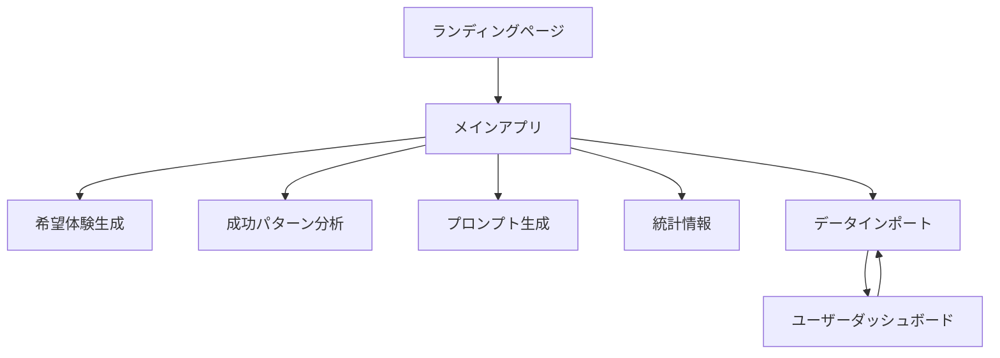

# PathPilot UI/UX 設計ドキュメント
**AI就活パイロット - 包括的ユーザー体験設計**

Version: 2.0  
Last Updated: 2025-01-06  
Status: Production

---

## 📋 目次

1. [プロダクトビジョン](#1-プロダクトビジョン)
2. [ユーザーペルソナ](#2-ユーザーペルソナ)
3. [ユーザージャーニーマップ](#3-ユーザージャーニーマップ)
4. [デザインシステム](#4-デザインシステム)
5. [画面フロー・情報アーキテクチャ](#5-画面フロー情報アーキテクチャ)
6. [インタラクションデザイン](#6-インタラクションデザイン)
7. [ユーザビリティ・アクセシビリティ](#7-ユーザビリティアクセシビリティ)
8. [パフォーマンス・品質指標](#8-パフォーマンス品質指標)

---

## 1. プロダクトビジョン

### 🎯 ミッション
「AIの力で、すべての求職者に『内定をもらえるかも』という希望体験を提供し、戦略的な就職活動を実現する」

### 🌟 コアバリュー・体験価値
- **希望の創出**: 具体的な成功イメージの提供
- **不安の解消**: 戦略的アプローチによる自信獲得
- **個人化**: 一人ひとりに最適化された支援
- **継続的サポート**: 内定獲得まで伴走する安心感
- **データドリブン**: 科学的アプローチによる戦略立案

### 🚀 差別化要素・UX優位性
1. **感情ファーストアプローチ**: ユーザーの不安・ストレスを考慮した体験設計
2. **AIプロンプトオーケストレーション**: ユーザー状況に完全適合したプロンプト生成
3. **段階的複雑性管理**: シンプルから詳細へのプログレッシブディスクロージャー
4. **ビジュアルダッシュボード**: 就活状況の可視化と次のアクション提示
5. **スクリーンショット解析**: 既存ツールのデータを自動取り込み
6. **即座の価値実感**: 登録不要で即座に価値を体験

---

## 2. ユーザーペルソナ

### 👤 プライマリーペルソナ: 転職活動中の若手社会人「田中大介さん」

**基本情報**
- 年齢: 26歳
- 職業: 営業職（3年目）
- 居住地: 東京都
- 年収: 420万円

**現状と目標**
- 現状: 現職に満足していないが、転職活動の進め方がわからない
- 目標: マネージャー職で年収500万円以上の企業への転職

**行動パターン**
- 平日夜と週末に転職活動
- スマートフォンで情報収集することが多い
- 複数の転職サイトを使い分け
- AIツール（ChatGPT、Claude）を日常的に使用

**感情・動機**
- 現職への不満とキャリアアップへの意欲
- 転職失敗への不安
- 効率的に進めたいという願望
- 面接での自己アピールに対する不安

**ペインポイント**
- 複数企業への応募管理が煩雑
- 時間不足
- 情報の散在
- 企業研究に時間がかかりすぎる
- 面接対策の効果的な方法がわからない
- 転職活動の進捗が見えにくい

**PathPilot利用シナリオ**
1. ランディングページから即座にデモ体験
2. AIツールで現状を詳細分析
3. ダッシュボードで進捗管理
4. AIプロンプトで面接対策

### 👤 セカンダリーペルソナ: 新卒就活生「鈴木花子さん」

**基本情報**
- 年齢: 22歳
- 所属: 私立大学経済学部4年生
- 居住地: 大阪府

**現状と目標**
- 現状: 就職活動を始めたばかりで方向性が定まらない
- 目標: 安定した大手企業への就職

**行動パターン**
- 大学のキャリアセンターを活用
- 友人と情報共有することが多い
- SNSで就活情報を収集
- オンライン説明会やセミナーに参加

**ニーズ・ペインポイント**
- 就活の進め方理解 / 経験不足
- ES作成支援 / 自己分析の難しさ
- 業界研究の効率化 / 業界理解の浅さ
- 就職活動への漠然とした不安
- 周りと比較してしまう焦り
- 社会人としての自信のなさ

---

## 3. ユーザージャーニーマップ

### 🗺️ 完全なユーザー体験フロー

```
認知 → 関心 → 体験 → 導入 → 活用 → 成功 → 推奨
```

#### **Stage 1: 認知（Awareness）**
**シナリオ**: Google検索「AI 転職支援」でPathPilotを発見

**タッチポイント**: 
- Google検索結果
- SNS投稿  
- 友人からの紹介

**ユーザーの感情**: 
- 期待感（40%）
- 懐疑心（35%）
- 好奇心（25%）

**行動**:
- ランディングページへのアクセス
- 他のサイトとの比較検討
- レビューや評判の確認

**UX施策**:
- ファーストビューで価値提案を明確化
- 3つの主要機能をアイコンで視覚化
- 「完全無料」「登録不要」の安心感訴求

#### **Stage 2: 関心（Interest）**
**シナリオ**: ランディングページで機能を確認

**タッチポイント**:
- ヒーローセクション
- 機能説明カード
- 使い方ガイド
- デモボタン

**ユーザーの感情**:
- 興味（50%）
- 期待（30%）
- 迷い（20%）

**行動**:
- 機能説明の詳細読み込み
- デモ動画の視聴
- 料金体系の確認

**UX施策**:
- 機能価値の理解促進
- 使いやすさの印象創出
- 試用への意欲向上

#### **Stage 3: 体験（Experience）**
**シナリオ**: デモ機能で実際の価値を体験

**タッチポイント**:
- 希望体験生成
- 成功パターン分析
- プロンプト生成

**ユーザーの感情**:
- 驚き（40%）
- 興奮（35%）
- 満足（25%）

**行動**:
- 各機能を順番に試す
- 結果の詳細確認
- 友人への共有検討

**UX施策**:
- ワンクリックで即座に体験開始
- ローディング中のアニメーション
- 結果の視覚的プレゼンテーション
- 即座の価値実感創出

#### **Stage 4: 導入（Onboarding）**
**シナリオ**: より詳細な分析のためデータインポートを実施

**タッチポイント**:
- データインポートガイド
- AIツール連携
- JSON取得・インポート

**ユーザーの感情**:
- 期待（45%）
- 作業感（30%）
- 不安（25%）

**行動**:
- プロンプトのコピー
- AIツールでの情報入力
- データの確認・修正

**UX施策**:
- ステップバイステップガイド
- プロンプトのワンクリックコピー
- エラーハンドリングと再試行
- スムーズな導入体験

#### **Stage 5: 活用（Engagement）**
**シナリオ**: パーソナライズされたダッシュボードで継続利用

**タッチポイント**:
- ユーザーダッシュボード
- 進捗管理ツール
- 推奨アクション

**ユーザーの感情**:
- 安心（50%）
- 意欲（30%）
- 集中（20%）

**行動**:
- 毎日の進捗確認
- 推奨アクションの実行
- データの定期更新

**UX施策**:
- 視覚的なプログレス表示
- 次のアクションの明確化
- 成功体験の強調
- 習慣的な利用促進

#### **Stage 6: 成功（Success）**
**シナリオ**: 内定獲得による目標達成

**タッチポイント**:
- 成功報告機能
- 達成記録
- 振り返りレポート

**ユーザーの感情**:
- 達成感（60%）
- 感謝（25%）
- 誇り（15%）

**行動**:
- 成功体験の記録
- 振り返りの実施
- 体験談の作成

#### **Stage 7: 推奨（Advocacy）**
**シナリオ**: 他者への推奨とコミュニティ参加

**タッチポイント**:
- レビュー投稿
- SNS共有
- 紹介制度

**ユーザーの感情**:
- 満足（50%）
- 貢献意欲（30%）
- 帰属意識（20%）

**行動**:
- 口コミ投稿
- 友人への紹介
- 成功事例の共有

---

## 4. デザインシステム

### 🎨 ビジュアルアイデンティティ

#### **カラーパレット**
```css
/* Primary Colors */
--primary-blue: #1e3a8a;    /* 信頼性・プロフェッショナル */
--primary-light: #2563eb;   /* アクセント・インタラクティブ */

/* Secondary Colors */
--secondary-amber: #fbbf24;  /* 希望・ポジティブ */
--secondary-orange: #ff8c42; /* エネルギー・行動喚起 */

/* Semantic Colors */
--success-green: #22c55e;    /* 成功・達成 */
--warning-yellow: #eab308;   /* 注意・確認 */
--error-red: #ef4444;        /* エラー・警告 */

/* Neutral Colors */
--gray-900: #1a202c;         /* 主要テキスト */
--gray-600: #6b7280;         /* 補助テキスト */
--gray-50: #f8fafc;          /* 背景色 */
```

#### **タイポグラフィ**
```css
/* Font Families */
--font-primary: 'Inter', -apple-system, BlinkMacSystemFont;
--font-accent: 'Poppins', sans-serif;

/* Font Sizes */
--text-xs: 0.75rem;     /* 12px */
--text-sm: 0.875rem;    /* 14px */
--text-base: 1rem;      /* 16px */
--text-lg: 1.125rem;    /* 18px */
--text-xl: 1.25rem;     /* 20px */
--text-2xl: 1.5rem;     /* 24px */
--text-3xl: 1.875rem;   /* 30px */
--text-4xl: 2.25rem;    /* 36px */
--text-5xl: 3rem;       /* 48px */
```

#### **スペーシングシステム**
```css
/* Spacing Scale */
--space-1: 0.25rem;   /* 4px */
--space-2: 0.5rem;    /* 8px */
--space-3: 0.75rem;   /* 12px */
--space-4: 1rem;      /* 16px */
--space-6: 1.5rem;    /* 24px */
--space-8: 2rem;      /* 32px */
--space-12: 3rem;     /* 48px */
--space-16: 4rem;     /* 64px */
```

### 🧩 コンポーネント設計

#### **ボタンスタイル**
1. **Primary Button**
   - 背景: グラデーション（amber → orange）
   - ホバー: 上方移動 + シャドウ強調
   - 用途: 主要アクション

2. **Secondary Button**
   - 背景: 半透明白
   - ボーダー: 白30%
   - 用途: 補助アクション

3. **Icon Button**
   - アイコン + テキストの組み合わせ
   - 左側にアイコン配置
   - 用途: 機能説明付きアクション

#### **カードデザイン**
- 背景: 白95% + backdrop-blur
- ボーダー: 白20%
- 角丸: 20px (rounded-3xl)
- シャドウ: 複数レイヤー

#### **アニメーション**
```css
/* Fade In Up */
@keyframes fadeInUp {
  from {
    opacity: 0;
    transform: translateY(30px);
  }
  to {
    opacity: 1;
    transform: translateY(0);
  }
}

/* Hover Effects */
transition: all 0.3s ease;
transform: translateY(-2px);
```

---

## 5. 画面フロー・情報アーキテクチャ

### 📱 主要画面構成



### 🖼️ 画面詳細

#### **1. ランディングページ**
**構成要素**:
- ヒーローセクション（価値提案）
- 機能紹介カード × 3
- 使い方ステップ
- CTA（Call to Action）

**インタラクション**:
- スムーズスクロール
- ホバーエフェクト
- パララックス効果

#### **2. メインアプリ**
**構成要素**:
- ウェルカムビュー
- 4つの機能ボタン
- データインポート案内

**インタラクション**:
- カード選択アニメーション
- プログレッシブディスクロージャー

#### **3. データインポート**
**構成要素**:
- 3ステップウィザード
- プロンプト表示エリア
- JSON入力フィールド
- プレビュー画面

**インタラクション**:
- ステップインジケーター
- バリデーション
- 成功フィードバック

#### **4. ユーザーダッシュボード**
**構成要素**:
- 3カラムレイアウト
- ステータスカード
- プログレスチャート
- アクションリスト

**インタラクション**:
- リアルタイム更新
- ツールチップ
- 展開/折りたたみ

### 🏗️ 情報アーキテクチャ

#### **階層構造**
```
Level 1: 主要機能（4つ）
├── Level 2: 機能詳細
│   ├── Level 3: 設定・オプション
│   └── Level 3: 結果・レポート
└── Level 2: ヘルプ・ガイド
```

#### **ナビゲーション設計**
- **主要**: 常時表示のメインメニュー
- **文脈**: 現在位置に応じたサブメニュー
- **補助**: ヘルプ、設定等のユーティリティ

#### **情報優先度**
1. **Primary**: 現在のタスクに直接関連
2. **Secondary**: 関連する補助情報
3. **Tertiary**: 背景情報、詳細データ

### 📊 データ表示戦略

#### **可視化原則**
- **重要度**: サイズ、位置、色で表現
- **関係性**: グルーピング、線、矢印
- **時系列**: 左から右、上から下
- **分類**: 色、形、テクスチャ

#### **情報密度管理**
- **概要**: 高レベル情報を先に
- **詳細**: 必要に応じて展開
- **フィルタ**: ユーザーが選択的に表示
- **検索**: 大量データからの発見

---

## 6. インタラクションデザイン

### 🎯 マイクロインタラクション

#### **ローディング状態**
```jsx
<FaSpinner className="animate-spin" />
// 回転アニメーション + テキスト変更
```

#### **成功フィードバック**
```jsx
// チェックマークアニメーション
// 色の変化: gray → green
// スケールアニメーション
```

#### **ホバーエフェクト**
- カード: 上方移動 + シャドウ強調
- ボタン: 色の深化 + スケール
- リンク: アンダーライン出現

### 🔄 状態遷移

#### **ボタン状態**
1. Default: 通常表示
2. Hover: 視覚的フィードバック
3. Active: 押下時の反応
4. Loading: 処理中表示
5. Disabled: 非活性状態

#### **フォーム状態**
1. Empty: 初期状態
2. Focus: 入力中
3. Valid: 検証成功
4. Error: エラー表示
5. Success: 完了

### 🤝 ユーザーとの対話設計

#### **フィードバック戦略**
- **即座フィードバック**: ボタンクリック、入力時
- **進捗フィードバック**: プロセス完了度の表示
- **成果フィードバック**: 達成状況の可視化
- **感情フィードバック**: 励ましメッセージ、称賛

#### **エラー対応戦略**
- **予防**: 明確なガイド、バリデーション
- **検出**: リアルタイム検証
- **修正**: 具体的な修正方法提示
- **学習**: エラーパターンの分析・改善

#### **状態管理戦略**
- **永続化**: ローカルストレージ活用
- **同期**: クラウド同期オプション
- **復元**: セッション復元機能
- **一貫性**: 画面間での状態保持

### 💫 感情デザイン

#### **不安軽減アプローチ**
- 明確な次ステップの提示
- 進捗の可視化
- 成功事例の提示
- サポート情報の提供

#### **希望創出アプローチ**
- ポジティブな表現の使用
- 成功イメージの具体化
- 小さな達成の積み重ね
- 将来ビジョンの描写

#### **自信向上アプローチ**
- 能力の可視化
- 強みの発見支援
- 改善点の建設的提示
- 成長実感の創出

---

## 7. ユーザビリティ・アクセシビリティ

### ✅ Jakob Nielsenの10原則への対応

#### **1. システム状態の可視性**
- ローディング状態の表示
- 進捗インジケーター
- 現在位置の明示
- 処理中状態の通知

#### **2. システムと現実世界の整合**
- 就活業界の専門用語使用
- 実際のプロセスに沿った流れ
- 馴染みのあるアイコン使用
- 自然な操作順序

#### **3. ユーザーコントロールと自由度**
- 戻る・キャンセル機能
- 編集・修正機能
- カスタマイズオプション
- データエクスポート機能

#### **4. 一貫性と標準**
- 統一されたデザインルール
- 共通のインタラクションパターン
- 標準的なUI要素の使用
- プラットフォーム慣習の遵守

#### **5. エラー防止**
- 入力バリデーション
- 確認ダイアログ
- デフォルト値の提供
- ガイドメッセージ

#### **6. 記憶より認識**
- 視覚的な手がかり
- オプションの表示
- 過去の選択履歴
- コンテキスト情報

#### **7. 使用の柔軟性と効率性**
- ショートカット機能
- バッチ処理オプション
- カスタマイズ可能性
- エキスパート向け機能

#### **8. 美的でミニマルなデザイン**
- 必要な情報のみ表示
- 視覚的階層の明確化
- 余白の効果的使用
- 装飾の最小化

#### **9. エラー認識・診断・回復**
- 明確なエラーメッセージ
- 問題の原因説明
- 具体的な解決方法
- サポートへの誘導

#### **10. ヘルプとドキュメント**
- コンテキストヘルプ
- FAQ充実
- チュートリアル提供
- サポート連絡先

### ♿ WCAG 2.1準拠

#### **カラーコントラスト**
- 通常テキスト: 4.5:1以上
- 大きいテキスト: 3:1以上
- インタラクティブ要素: 3:1以上

#### **キーボードナビゲーション**
- Tabキーでの移動
- Enterキーでの選択
- Escキーでのキャンセル
- フォーカスインジケーター

#### **スクリーンリーダー対応**
- 適切なaria-label
- セマンティックHTML
- ランドマークロール
- 代替テキスト

#### **レスポンシブデザイン**
- モバイルファースト
- タッチターゲット: 44×44px以上
- 拡大縮小対応: 200%まで

---

## 8. パフォーマンス・品質指標

### 📊 技術パフォーマンス指標

#### **Core Web Vitals**
- **LCP (Largest Contentful Paint)**: < 2.5秒
- **FID (First Input Delay)**: < 100ms
- **CLS (Cumulative Layout Shift)**: < 0.1

#### **カスタムメトリクス**
- **Time to Interactive**: < 3秒
- **First Meaningful Paint**: < 1.5秒
- **API Response Time**: < 200ms

### 📈 UX品質指標

#### **Core UX Metrics**
- **Task Success Rate**: 95%以上
- **Time on Task**: 平均5分以内（デモ体験）
- **Error Rate**: 5%以下
- **User Satisfaction**: 4.5/5.0以上

#### **Engagement Metrics**
- **Return Visit Rate**: 70%以上
- **Feature Adoption**: 80%以上
- **Session Duration**: 平均15分以上
- **Conversion Rate**: 25%以上（デモ→データインポート）

#### **Emotional Metrics**
- **Confidence Increase**: +30%（使用前後比較）
- **Anxiety Reduction**: -40%（使用前後比較）
- **Hope Level**: 4.0/5.0以上
- **Recommendation Score (NPS)**: 50以上

### 🚀 最適化戦略

#### **アセット最適化**
- 画像: WebP形式、遅延読み込み
- フォント: サブセット化、プリロード
- JavaScript: コード分割、Tree Shaking

#### **キャッシング戦略**
- Service Worker実装
- ローカルストレージ活用
- CDNエッジキャッシング

#### **レンダリング最適化**
- React.memo使用
- useMemoフック活用
- 仮想スクロール実装

### 🎯 継続改善フレームワーク

#### **測定サイクル**
```
計画 → 実装 → 測定 → 分析 → 改善 → 計画...
```

#### **A/Bテスト要素**
- メッセージング
- レイアウト
- インタラクション
- 機能順序

#### **ユーザーフィードバック分析**
- 感情表現の分析
- 機能価値の理解度
- 改善要望の収集
- 成功体験の共有

---

## 📝 まとめ

PathPilotのUI/UX設計は、**「不安から希望への転換」** を核心とした感情中心の体験設計です。

### 🎯 核心的な設計原則
1. **即座の価値提供**: 登録不要で即体験、3分以内での価値実感
2. **段階的な複雑性**: シンプルから詳細へのプログレッシブディスクロージャー
3. **視覚的フィードバック**: 進捗の可視化による達成感創出
4. **感情的サポート**: 不安を希望に変換する体験設計
5. **個人化された支援**: 一人ひとりに最適化された継続的な価値提供

### 🌟 UX成功の鍵
- **感情ファーストアプローチ**: ユーザーの不安・ストレスを第一に考慮
- **即座価値実現**: 3-5分での価値体験とWow体験の創出
- **段階的な深化**: 自然な流れでの機能発見と利用拡大
- **継続的な励まし**: 小さな成功の積み重ねによる自信向上
- **包括的な支援**: ツール提供から感情サポートまでの総合的体験

この設計により、ユーザーは就活の不安から解放され、**「内定をもらえるかも」** という希望を持って戦略的かつ効果的に就職活動に取り組むことができます。

---

*Document Version: 2.0*  
*Last Updated: 2025-01-06*  
*Next Review: 2025-02-06*